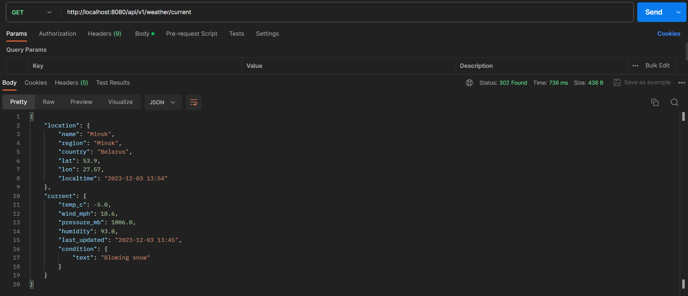
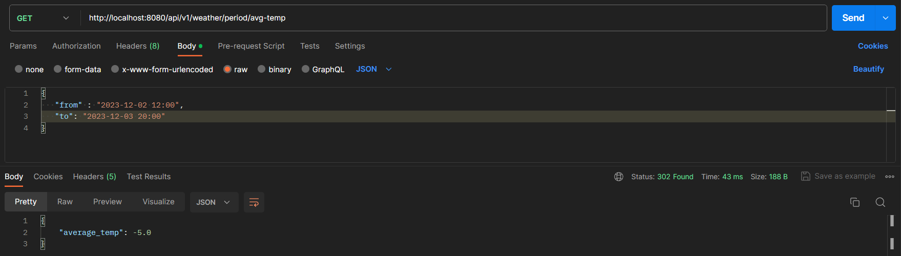

<h1 align="center"> RESTful WeatherReportApplication</h1>

<h2 align="center">Author: <a href="https://github.com/Alivit" target="_blank">Chuiko Vitaliy</a></h2>

<h2 align="center">Введение</h2>

Всем привет, я здесь, чтобы продемонстрировать работу своей программы. 
Программа из себя представляет RESTful web-service, реализующей функционал для работы с системой анализа погоды.

<h2 align="center">Задание</h2>

Необходимо разработать анализатор погоды. Нужно использовать сторонние API. Приложение будет запрашивать погоду с заданной в настройках периодичностью по определенному городу.

Как это работает:

Приложение получает информацию о погоде в Минске от стороннего API, по расписанию и  сохраняет ее в БД.
(Город по которому запрашивается погода всегда один и тот же)

Первый endpoint должен в качестве ответа отдавать информацию о текущей погоде - наиболее актуальная информация, которая хранится в БД сервиса. В ответе должна содержаться следующая информация:

1) Температура
2) Скорость ветра в м/ч
3) Атмосферное давление в гектопаскалях или миллибарах
4) Влажность воздуха
5) Погодные условия (солнечно, облачно и т.д.)
6) Локация

Второй endpoint должен выдавать рассчитанную на основании имеющихся в сервисе данных информацию о среднесуточной температуре. Пользователь должен будет иметь возможность получить информацию за указанный период.

Request
{
“from”: “22-08-2021”,
“to”: “24-08-2021”
}
Response
{
“average_temp”: 10
// и другие
}

Взаимодействие пользователя с приложением происходит через REST API.

<h2 align="center">Требования</h2>

Требования которые нужно было выполнить в данном проекте:

1. Приложение должно быть реализовано на языке Java версии 8+ ;
2. Код должен соответствовать принципам Low Coupling, принципам ООП и Clean Code;
3. Код должен соответствовать Java code style (именование переменных, структура класса и др.);
4. Приложение должно содержать качественную обработку ошибок и логирование;
5. Использовать Spring Framework(Spring Boot).
6. Покрытие unit тестами.
7. Описать взаимодействие с приложением в README.
8. Вместе с приложением должны содержаться скрипты для создания схемы БД (использование Docker compose будет плюсом)

<h2 align="center">Технологии</h2>

Технологии которые использовались в данном проекте:

- Java 17.
- Gradle 8.0.
- Postgresql
- Spring 6.0.8.
- Spring Boot 3.1.0.
- Spring-boot-starter-data-jpa.
- Spring-boot-starter-web.
- Spring-boot-starter-test.
- Spring-boot-docker-compose.
- Springdoc-openapi-starter-webmvc-ui 2.1.0.
- Jackson-datatype-jsr310 2.9.8.
- ModelMapper 3.1.0.
- Liquibase.
- Lombok.
- Docker.

Также был использован сторонний API: https://api.weatherapi.com для получения данных о погоде

<h2 align="center">Разработка</h2>

При разработке проекта были:
1. Созданы модели DTO которые обрабатываются на контроллере, и Entity для отображения таблиц и работы с базой данных.
2. Создан класс [ApiClient](src/main/java/ru/alivit/weatherReport/client/ApiClient.java), который прослушивает по расписанию
   данные со стороннего API и записывает их в базу данных.
3. Разработаны Контроллеры для обработки запросов и отправки ответов.
4. Разработаны сервисы для обработки данных с контроллеров и работы с базой данных.
5. Создан класс [ControllerErrorHandler](src/main/java/ru/alivit/weatherReport/http/handler/ControllerErrorHandler.java)
   для обработки всех ошибок которые могут прийти на контроллер.
6. Добавлено логирование по средствам аспектов для выведения полученной и отправленной информации в логах.
7. Подключён Docker compose и написан sql скрипт для создания базы данных.
8. Подключён Liquibase для миграции.
9. Написаны unit тесты.

<h2 align="center">Инструкция для запуска приложения</h2>

1. Для того чтобы приложения хорошо запускалось нужно чтобы все технологии строго были похожи на те которые описаны выше.
2. Все настройки проекта лежат в [application.yml](src/main/resources/application.yml).
3. В [application.yml](src/main/resources/application.yml) можно настроить расписание по запрашиванию данных со стороннего API.
4. Запустить Docker.
5. Запустить [NewsServiceApplication.java](src/main/java/ru/alivit/weatherReport/WeatherReportApplication.java).
6. Проект готов к работе.

<h2 align="center">Пример работы программы</h2>

Для тестировании API используется Postman

Первый endpoint отдаёт информацию о текущей погоде - наиболее актуальная информация, которая хранится в БД сервиса:
http://localhost:8080/api/v1/weather/current

Второй endpoint выдаёт рассчитанную на основании имеющихся в сервисе данных информацию о среднесуточной температуре:
http://localhost:8080/api/v1/weather/period/avg-temp

